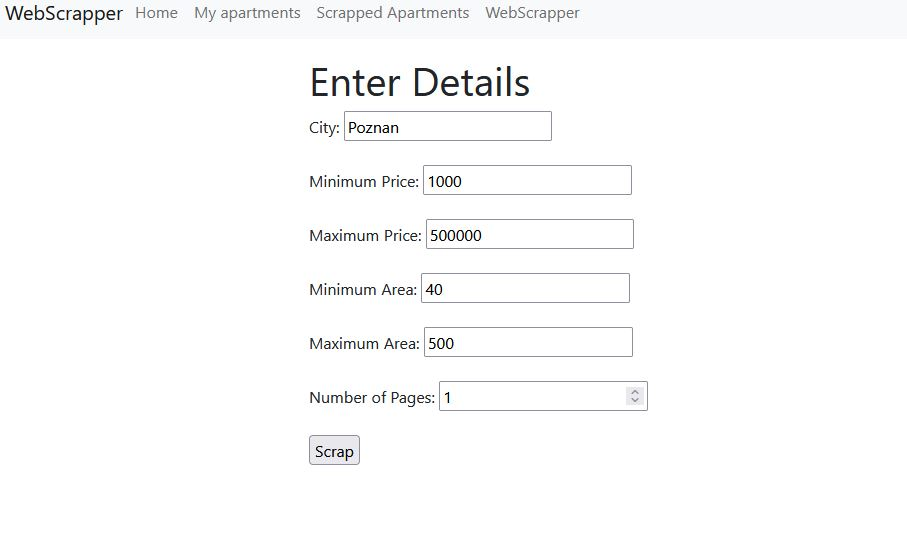
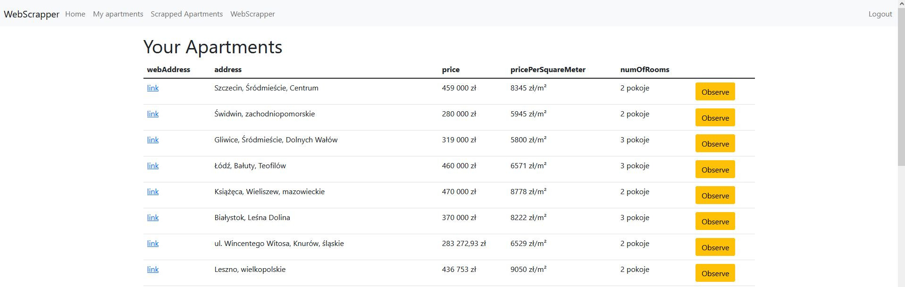
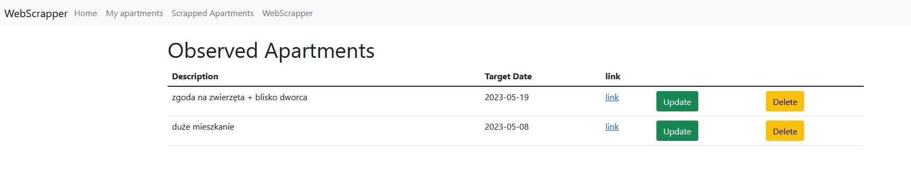
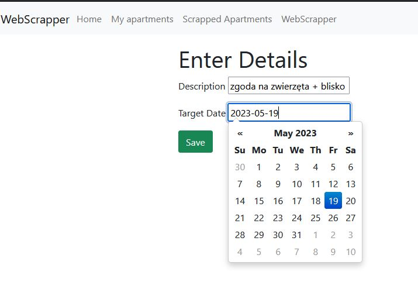

# SpringBoot-app-Webscraper
Webscrapping app where you can browse avalivable apartments at otodom.pl website 

WebScrapper Options:

List of Scrapped Apartments:

You can store apartments in my apartments list: 

data is keeped in SQL database launched in docker conatiner.

CRUD operations are implemented

